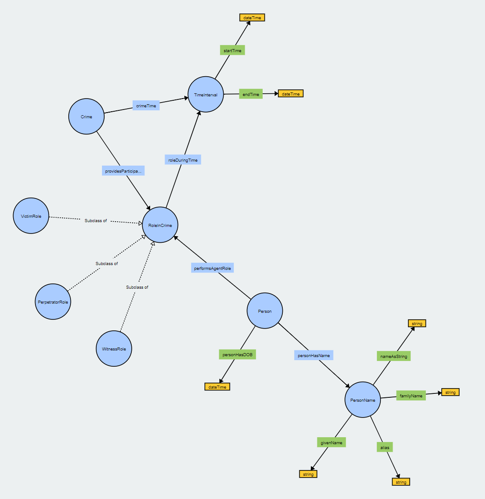

# CoModIDE Tutorial Example Session

**Competency questions:** 

* Who was the victim of a particular crime? Who was the perpetrator?
* When did a burglary take place?
* At what point during the kidnapping did all perpetrators participate -- at what time did one of them stop participating?
* How man aliases does a certain criminal have?

**Target model**

